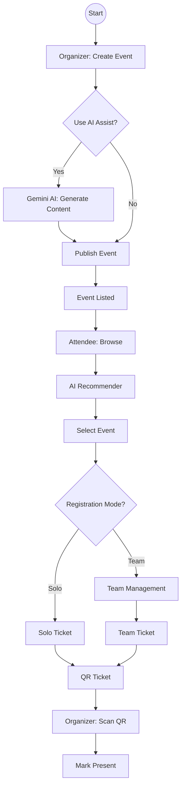

# 📊 EventHorizon: Diagrams & Narratives

## 📖 System Flow Summary (One Paragraph)
**EventHorizon streamlines the entire event lifecycle by connecting three key actors: the Organizer, the Attendee, and the AI Agent. The journey starts when an Organizer uses the AI Agent (Gemini) to auto-generate professional event content, which is instantly published to the ecosystem. Attendees receive personalized recommendations based on their interests and can register either individually or by forming teams natively within the platform. The process culminates at the venue, where a generated QR ticket is validated in milliseconds using our high-velocity PWA scanner, ensuring a seamless, friction-free flow from initial idea to final entry.**

---

## 🏗️ Architecture Diagram
This high-level overview shows the technology stack and how the different layers communicate.

```mermaid
graph TD
    subgraph Client ["🖥️ Frontend (Client Layer)"]
        style Client fill:#e1f5fe,stroke:#01579b,stroke-width:2px
        UI[React.js + Tailwind CSS]
        PWA[PWA / Mobile View]
        SocketC[Socket.io Client]
    end

    subgraph Backend ["⚙️ Backend (Server / API)"]
        style Backend fill:#fff3e0,stroke:#e65100,stroke-width:2px
        API[Express API / Serverless Functions]
        AuthService[Auth Middleware]
        SocketS[Socket.io Server]
    end

    subgraph Database ["💾 Data Layer"]
        style Database fill:#e8f5e9,stroke:#1b5e20,stroke-width:2px
        Mongo[(MongoDB Atlas)]
    end

    subgraph Services ["☁️ External Services"]
        style Services fill:#f3e5f5,stroke:#4a148c,stroke-width:2px
        Gemini[✨ Google Gemini API<br/>(Generative AI)]
        Firebase[🔐 Firebase Auth]
    end

    %% Connections
    UI -->|REST / HTTP| API
    UI <-->|WebSocket Events| SocketS
    PWA --> UI

    API -->|Validate Token| Firebase
    API -->|CRUD Operations| Mongo
    API -->|Generate/Recommend| Gemini

    SocketS -->|Push Updates| UI
```

---

## 🚀 Simplified High-Level Flow (Short)
This captures the core value loop in 4 steps.

```mermaid
graph LR
    Create[🚀 Create Event<br/>(AI Assisted)] --> Match[🔍 Smart Match<br/>(Recommender)]
    Match --> Reg[🤝 Register<br/>(Team/Solo)]
    Reg --> Ticket[🎫 QR Ticket]
    Ticket --> Scan[⚡ Fast Scan<br/>(Entry)]
```

---

## 2. 🔄 Detailed Process Flow
This flowchart describes the complete life-cycle of an event.



## 3. 🎭 Use Case Diagram
Highlights primary actors and interactions.

```mermaid
usecaseDiagram
    actor "Organizer" as O
    actor "Attendee" as A
    actor "Gemini AI" as AI

    package "EventHorizon" {
        usecase "Create Event (AI)" as UC1
        usecase "Manage Teams" as UC3
        usecase "Scan QR Tickets" as UC4
        usecase "Discover Events" as UC6
        usecase "Register (Solo/Team)" as UC7
    }

    O --> UC1
    O --> UC3
    O --> UC4
    
    A --> UC6
    A --> UC7
    
    UC1 ..> AI : uses
    UC6 ..> AI : uses
```
